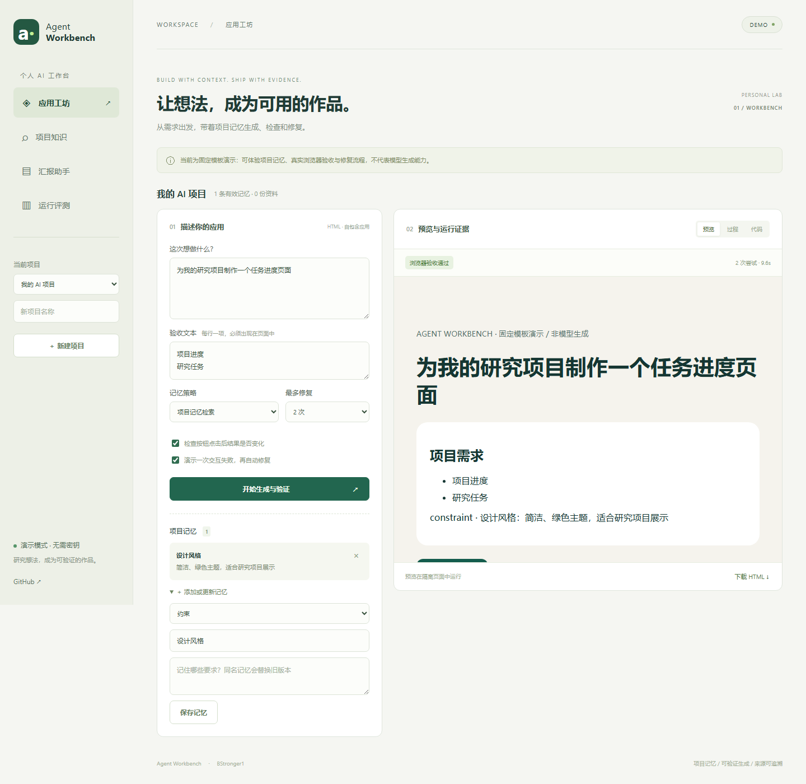
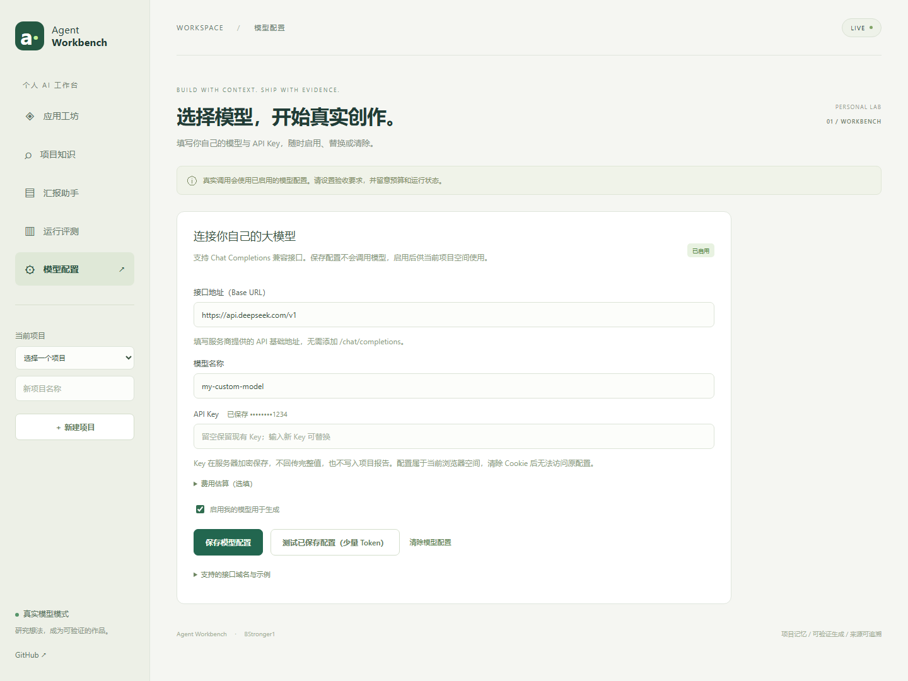

# Agent Workbench

个人 AI 工作台：把项目记忆、应用生成、浏览器验收与开发汇报连接起来。

**AI 技术栈升级：** 可选 Python/FastAPI 服务已接入 LangChain、LangGraph、PostgreSQL/pgvector、本地多语言 Embedding 与规划/编码/评审角色协作。支持结构化浏览器验收、检查点恢复、混合检索和带引用的 RAG。见 [升级架构与运行方法](docs/AI-UPGRADE.md)。新图工作流的外部模型对照尚未完成，内网部署更新待网络恢复；下述六任务结果属于原基础链路。

核心 AI 链路：需求与记忆上下文 → Chat Completions 模型调用 → HTML 结构与浏览器验收 → 将错误和上一版代码反馈给模型。支持最多 3 次修复、三种上下文策略、Token 预算与运行证据。

**状态：已完成真实模型测试，也支持无密钥演示。** 2026-10-07 使用 `DMXAPI-deepseek-v4-flash` 执行 6 个真实任务、8 次生成/修复调用，按原定契约最终通过 4/6；两项交互前置条件不匹配的失败及修复记录完整保留。见 [真实测试报告](docs/LIVE-RESULTS.md)。固定模板演示结果与真实结果分别记录。



## 产品

| 入口 | 当前能力 |
|---|---|
| 应用工坊 | 自包含 HTML 应用；需求与文本/按钮验收契约；生成→检查→有界修复；尝试记录、截图、版本选择和源码下载 |
| 项目知识 | 文本/Markdown 资料导入；中文双字和关键词检索；段落来源；无匹配时明确提示 |
| 汇报助手 | 从同一项目的有效记忆、资料、运行证据确定性生成 Markdown 汇报和演示提纲 |
| 运行评测 | 查看耗时、尝试次数、模型模式、Token 和配置价格下的估算费用；导出 JSON；固定评测集 |
| 模型配置 | 自填接口地址、模型名称与 API Key；按浏览器空间加密保存；连接测试、启停和清除 |

项目记忆包含约束、决策和经验。同名更新会使旧记忆失效，旧版本仍可审计；支持停用。生成时可选择无记忆、最近三次需求或项目记忆检索。基础模式为词法检索；可选 AI 服务提供 384 维语义向量与关键词 RRF 混合检索。尚未实现 HMMEM 或自动提炼记忆。

## 本地运行

需要 Java 21+、Maven 3.9+、Node 22。无需 MySQL、Redis、云存储或模型密钥。

```bash
npm ci --prefix web
npm run build --prefix web
mkdir -p src/main/resources/static
cp -R web/dist/. src/main/resources/static/
mvn -gs settings.xml -s settings.xml package
java -jar target/agent-workbench-0.1.0.jar
```

打开 `http://127.0.0.1:8123`。未配置浏览器时，结果只标为 `STATIC_VALIDATED`，不会标为浏览器验收通过。

启用真实浏览器验收：

```bash
cd qa
npm ci
npx playwright install chromium
cd ..
export QA_COMMAND="[\"node\",\"$(pwd)/qa/worker.mjs\"]"
java -jar target/agent-workbench-0.1.0.jar
```

Linux 的浏览器沙箱需要可用的用户命名空间及 Chromium 运行库。不能启动时任务标为失败，不通过关闭沙箱来掩盖环境问题。

首次进入点击“创建我的项目”；添加一条约束；勾选“演示一次交互失败，再自动修复”；运行后在“过程”中查看失败截图与第二次验收。演示会确定性修复预设缺陷，**没有模拟真实模型推理质量**。

## 填写自己的模型和 Key

打开侧栏 **模型配置**，填写服务商的 HTTPS Base URL、模型名称和 API Key，勾选启用后保存。无需修改服务器文件或重启。保存不会调用模型；“测试已保存配置”会发起一次少量 Token 的请求。留空 Key 可保留原值，清除配置会删除该空间保存的 Key。

配置属于当前浏览器空间；服务端使用 AES-256-GCM 加密保存，接口仅返回掩码。接口域名使用允许列表，部署者可扩展 `PROVIDER_ALLOWED_HOSTS`。默认支持 DeepSeek、阿里云百炼、SiliconFlow、OpenAI 等兼容服务的域名，具体模型需要填写服务商提供的名称。清除 Cookie 后无法访问原空间；公网使用前应启用 HTTPS。

当前实现 Chat Completions HTTP 接口，生成任务要求模型返回 `{"html":"..."}`。每次最多输出 4096 tokens；任务可设 0–3 次修复和保守 Token 预算。未返回用量的供应商不推算消耗；未配置价格不估算费用。真实供应商的兼容性、质量与账单仍需配置后验证。部署者也可选择配置服务器共享模型，见 [部署说明](docs/DEPLOYMENT.md)。



## 验证

```bash
mvn -gs settings.xml -s settings.xml test
cd qa
node smoke.mjs
node provider-smoke.mjs
node evaluate.mjs
# 真实 API 评测需显式 --live，并会产生费用：
# LIVE_ACCESS_TOKEN=... node evaluate.mjs --live
```

小规模真实测试使用 `node live-smoke.mjs --live`，默认 6 个任务，每个任务最多修复 1 次，支持临时个人模型配置；详细步骤见 [真实模型测试](docs/LIVE-EVALUATION.md)。任何真实测试入口在演示模式下都会停止，不能将演示结果标为真实模型验证。

见 [验证记录](docs/EVALUATION.md)、[演示评测原始数据](evidence/evaluation-demo.json) 和 [架构与边界](docs/ARCHITECTURE.md)。CI 会构建前后端、运行单元测试和浏览器端到端测试。

## 部署

支持固定内网 IP 的 HTTPS，服务器配置与客户端证书信任步骤见 [内网 HTTPS](docs/HTTPS.md)。

前端静态资源打包进 Spring Boot JAR，可在单台服务器的用户目录运行。部署脚本、独立运行环境目录与操作步骤见 [部署说明](docs/DEPLOYMENT.md)。当前针对个人工作台，没有微服务、容器编排或多实例数据库要求。

## 关于项目

Agent Workbench 是 [BStronger1](https://github.com/BStronger1) 开发的个人 AI 产品工作台，将应用工坊、项目知识、汇报和评测组织在同一项目空间中。

新增验证：13 项 Python 测试在 CI 中通过（含真实 pgvector 与真实 Embedding），结构化交互通过 Chromium 检查；六条中文检索样例的混合检索 Recall@3 为 5/6，关键词为 2/6。这是开发样例结果，不是通用效果结论。新图工作流真实模型对照因 HTTPS 连接错误在首次请求停止，见 [中断记录](evidence/graph-live-network-failure.json)。

项目采用 [MIT 许可](LICENSE)。依赖组件保留各自许可证，验证范围见 [项目说明](NOTICE.md)。
