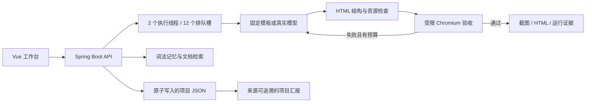

# 架构与设计边界

## 轻量化部署

工作台采用 Spring Boot + Vue 单体部署，前端资源打包进同一 JAR，状态通过本地快照持久化。无需数据库或模型密钥即可演示完整流程。本版输出自包含 HTML，不安装或执行模型生成的 npm 包和服务端代码。

## 状态与失败

状态包含 QUEUED、RUNNING、PASSED、STATIC_VALIDATED、FAILED、BUDGET_EXCEEDED、INTERRUPTED。浏览器不可用不能得到 PASSED；浏览器服务故障不触发模型修复；达到修复次数上限保留失败。服务重启将未结束的任务标为 INTERRUPTED，不伪造完成，也不自动重放付费请求。

项目数据采用每项目 JSON 快照、临时文件和原子替换；不支持多个进程同时写一个数据目录。重启后资料、运行和版本选择保留。浏览器持有随机 HttpOnly/SameSite 访问凭据，服务器保存摘要；不同凭据不能读取他人项目。清除浏览器 Cookie 会失去对应项目访问凭据，当前没有账号同步和找回流程。

## 验收与修复

输入契约是必需可见文本及可选按钮交互。结构校验检查文档标题、viewport、一级标题、禁用嵌入元素/外部资源。浏览器随后检查文本可见性、捕获 JavaScript 异常、点击主按钮并验证结果变化，保存截图。失败反馈和上一版 HTML 进入下一轮生成。版本保留完整快照，可将已通过版本重新选为成果。

这是一套窄任务验收协议，不代表任意网页的正确性、视觉质量或完整业务测试。没有实现通用测试生成、视觉像素回归或任意 npm 项目沙箱。

## 记忆与知识

同名记忆更新时旧版本停用并记录 supersededBy。约束在生成检索中得到优先权；文档问答按照词法相关性返回片段及段落 ID。检索最多 8 条，长文本限制输入长度。无记忆、最近三次需求、检索三种模式用于后续消融。尚无数据证明检索记忆优于基线，尚未接入 HMMEM。

知识页返回原文摘录，不调用模型编写答案；汇报使用已记录数据生成，不虚构进展。PPTX 导出、向量数据库、自动记忆提取属于后续工作。

## 隔离与资源边界

模型配置按浏览器空间隔离，以 AES-256-GCM 加密到 `data/providers`，空间摘要作为认证附加数据；随机主密钥单独保存于权限受限的 `.master-key`。完整 Key 不通过 API 回传，不写入项目记录或报告。该设计保护静态配置文件，不隔离拥有服务器账户权限的管理员。备份必须包含主密钥。

个人模型优先于部署者共享模型；任务提交时取配置快照，后续修改只影响新任务。未启用个人配置时使用服务器默认模式。用户接口地址只接受 HTTPS、标准端口和允许列表中的精确域名，不接受查询参数、用户凭据或任意内网地址；HTTP 客户端不跟随重定向。部署者可扩展允许列表，扩展前应核实服务地址。

- 生成内容不成为服务端路径或命令；工作台不执行生成的构建脚本。
- 浏览器 worker 的命令数组由部署者配置，模型无法修改；单次 45 秒上限，超时终止进程树。
- worker 浏览器不带用户资料或密钥，拦截外部请求；Linux 启用 Chromium 沙箱，不降级为 no-sandbox。
- 应用预览采用 opaque-origin iframe + CSP，禁止同源访问、外部子资源、表单和连接。不是虚拟机级的任意恶意程序运行服务，不作为任意代码执行入口开放。
- 每个凭据最多 20 项目，每项目最多 50 次运行、20 文档、200 记忆版本；全局项目和队列有上限。
- 所有写 API 要求自定义请求头并拒绝 cross-site Fetch；使用服务器共享模型另需至少 24 字符的服务端访问口令。个人 Key 只供其所属空间使用。
- 真实 API 预算是调用前的保守估计，实际计费用量仍以供应商为准。个人模型的价格由用户选填，共享模型价格由部署者维护。

当前适合个人或受控内网部署。扩大到公网多人产品前，需要账户与授权、限流、资料回收、HTTPS、独立浏览器服务、数据备份恢复和并发数据库。
