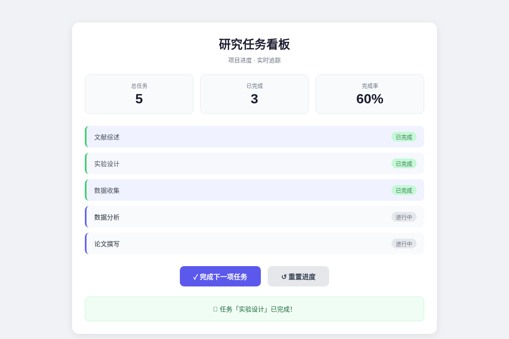
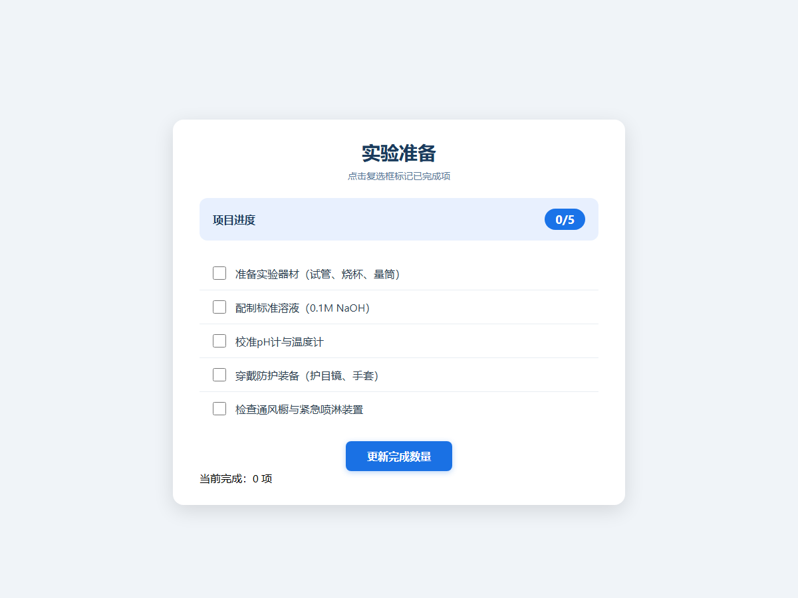

# DMXAPI 真实模型测试结果

日期：2026-10-07（Asia/Singapore）。

## 结论

使用接口模型名 `DMXAPI-deepseek-v4-flash` 完成 6 个真实任务、8 次生成/修复调用。首轮通过 4/6，最终通过 4/6；两项任务均触发一次真实修复，修复后仍未通过原定验收。没有注入演示故障，没有替换模型，没有重跑后只保留成功结果。

| 指标 | 本次结果 |
|---|---:|
| 首轮 / 最终通过 | 4/6 / 4/6 |
| 触发修复 / 修复成功 | 2 / 0 |
| 平均每任务耗时（含浏览器验收与修复） | 60.21 秒 |
| 供应商返回的输入 Token | 4,324 |
| 供应商返回的输出 Token | 12,099 |
| 合计 Token | 16,423 |

用量汇总基于运行中供应商返回的 `usage`，不是账单金额核对；没有配置单价，因此不推算货币费用。

## 方法与逐项结果

- 通过 [DMXAPI 国内站接口](https://doc.dmxapi.cn/jichu.html) 调用 `https://www.dmxapi.cn/v1`，模型列表确认所指定模型名可用。记录的是接口模型标识，未独立验证服务商内部路由或底层权重版本。
- 使用 3 个开发场景（研究任务、阅读进度、实验准备），各执行无记忆和检索记忆两种配置；每任务独立项目。
- 沿实际工作台链路完成请求、HTML 解析、结构检查、Chromium 文本与按钮验收、失败反馈和修复。每任务最多修复 1 次，保守预算 24000 Token；未修改生产提示词或放宽验收。
- 无记忆任务均未注入来源，检索任务均注入 1 条项目约束；这仅验证上下文传递，不证明记忆收益。

| 用例 | 上下文 | 最终结果 | 调用次数 | 耗时/秒 | 输入 / 输出 Token |
|---|---|---|---:|---:|---:|
| WB-001 | 无记忆 | 通过 | 1 | 45.73 | 160 / 1625 |
| WB-003 | 检索记忆 | 通过 | 1 | 63.93 | 239 / 1658 |
| WB-004 | 无记忆 | 通过 | 1 | 39.60 | 159 / 1535 |
| WB-006 | 检索记忆 | 通过 | 1 | 47.70 | 239 / 1867 |
| WB-007 | 无记忆 | 失败 | 2 | 64.42 | 1503 / 2336 |
| WB-009 | 检索记忆 | 失败 | 2 | 99.89 | 2024 / 3078 |

## 失败归因

WB-007 和 WB-009 均生成了带复选框的实验准备清单。初始选中项为 0，直接点“更新完成数量”后仍为 0，因此两轮均触发“点击主按钮后结果未发生可见变化”。真实修复请求收到错误与上一版代码后，仍保留了先勾选的交互前置条件。

在隔离浏览器中对最终失败产物做不调用模型的事后复查：先勾选一项再点按钮，两个页面都从 0 更新为 1，且无 JavaScript 异常。这说明它们的清单操作路径可用，但没有满足本次“直接单击即变化”的验收契约。原结果仍记为失败，不以事后操作更改成绩。

下一步应将可执行的交互前置条件写进验收契约和修复反馈，分别覆盖直接操作与需要输入/选择的流程，然后在新用例上重新评测；不能为使现有案例通过而事后放宽标准。

## 原始证据与边界

- [完整运行记录（含八份生成/修复 HTML、反馈、时间与用量）](../evidence/live-smoke.json)
- [两个失败产物的隔离复查记录](../evidence/live-diagnostics.json)
- [测试入口](../qa/live-smoke.mjs)

本次是六任务开发场景检查，未做重复实验、独立保留集、模型对比或记忆收益检验，不能外推为通用成功率。已确认真实 API 生成及两次错误反馈修复调用实际执行，但本轮没有成功修复案例。临时模型配置已删除，密钥不在报告或公开仓库中。
